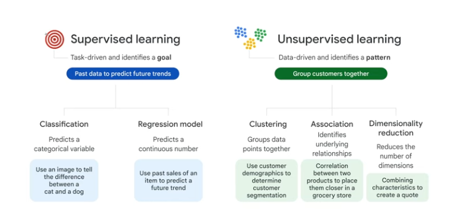

This Repo contains the basics of Vertex AI

**Data Preparation**
- Data Uploading
- Feature Engineering

**Model Training**
- Model Training (kochen)
- Model Evaluation (kosten)

**Model Deployment**

Structured Data - can be put in Tables (numbers and text e.g.)

Unstructured Data - can not be put in Tables (like Images and Videos)

MLOps:
- Return to raw data and generate more useful features
- Data drifting, accuracy drops
- check data sources and adjust model parameters

2 options to build ML models:
- AutoML (codeless)
    - Allows: image, tabular, text and video data
- Custom training: code-based

Provide labels to the data (a label is a training goal, e.g. dog or cat)

Data can be uploaded from a local source, BigQuery or Cloud Storage

Features:
- Feature Store (Repo for organizing, storing and serving features to feed to models)
    Benefits: 
    - Features are shareable for training or serving tasks
    - Features are reusable
    - Features are scalable
    - Features are easy to use
- Vizier (tune hyperparameters in complex ml models)
- Explainable AI (interpret training performance and model behaviors)
- Pipelines (automate and monitor the ML)

Supervised learning is task-driven and identifies a goal (data is labeled)
Unsupervised learning is data-driven and identifies a pattern (data is unlabeled)

Hyperparameters are the user-defined knobs of a machine, that helps to guide the machine learning progress
- With AutoML this happens automatically

